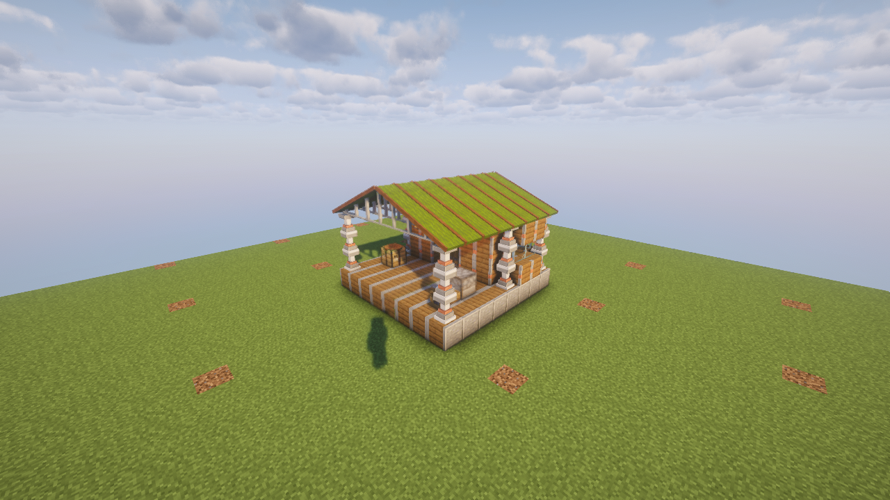

# C.A.M.P.

A portable expedition shelter for Minecraft 1.21.1 and NeoForge 21.1.248.

Place the reinforced crate and an 8×8 campsite unfolds with a grounded deck,
enclosed sleeping and storage room, covered workshop and pitched canvas roof.
Real redstone-powered pistons move the deck, wall and roof sections. The camp then
attaches its bedroll, double chest, crafting table, furnace and campfire.

**Version 0.2.0.** Download from [GitHub Releases](https://github.com/the-rusty-shackleford/minecraft-mobile-camp/releases/tag/v0.2.0).
Install matching versions on client and server. The shared-pack rollout is
**1.52.0**; use **Update Pack** in Prism when the deployment is announced.

The local **0.3.0** development update adds the Cartography Module; publication
and deployment await release approval. Existing camps can install it through the
blue control without replacing the camp.

## Using your camp

1. Find clear, loaded **10×8 space with six blocks of headroom**. The camp itself
   occupies 8×8; a one-block strip on each side is reserved for folding machinery.
   It extends forward from the crate in the direction you face.
   Foundations fill gaps up to three blocks deep under the whole deck.
   Obstructions, liquids and unsupported sites refuse placement, leaving the camp
   and its module cargo in your inventory.
2. Place the crate and keep the site clear during its eight-second transformation.
   You may have one deployed camp across all dimensions, including unloaded camps.
   Deployment and folding pause while a creature or player occupies the site or
   its machinery clearance. A cancelled piston stroke safely packs the camp back
   into a pickup.
3. Use the equipment normally. Light the campfire when needed. The **bedroll lets
   you sleep without changing your respawn point**. It refuses unsafe dimensions
   without exploding.
4. To change equipment, step outside and **right-click the blue module control**
   beside the core’s red switch. The first four slots are sleeping, storage,
   crafting and cooking. Take a module out to detach its equipment; insert a
   compatible module to attach it. The field kitchen adds a smoker. The
   **Cartography Module** fits the third (crafting) slot and adds a cartography
   table beside the crafting table, supporting vanilla maps and Magical Map atlases.
   Close the screen before packing. Only the owner or an operator may operate
   these controls; other players can use the stations.
5. **Right-click the core’s red collapse switch** to fold the camp, then pick up
   the single packed item. Mining the core requests the same action.
   Sneak-use the packed item in the air to edit its modules while travelling.

Modules retain both chest halves, station inventories and cooking state when
removed or transported. Cooking pauses in transit. Packing restores displaced
vegetation and terrain. Attached parts cannot be harvested separately or moved
with outside pistons, and the reserved interior does not accept extra built blocks.

Camps deployed by 0.1.0 retain their existing layout until packed and redeployed.
Their old attached beds also stop changing respawn points after this update.
A legacy camp completes its first folding with the older animation; redeployment
uses the new foundation, bedroll, controls and piston mechanism.

## Building the structure yourself

Decks, frames, panels, canvas, module mounts and bedrolls are independently
craftable, placeable and recoverable. Empty structural parts can be moved with
ordinary pistons and redstone. Place three blocks in a row in front of a piston
with an empty destination beyond them, then power it to reproduce a camp wing’s
one-block slide. C.A.M.P. coordinates those strokes across both wings and all five
layers, stores the fixed spine, and attaches equipment afterwards.

Vanilla chests and furnaces cannot be pushed by ordinary pistons, so install those
stations after arranging the structure. Module mounts are structural docking pads;
the prefab core provides automatic module management and portable cargo storage.

Placed canvas faces the placement direction. Right-click a freestanding canvas
block to cycle its roof rise, or sneak-right-click to toggle its gable.
Attached camp canvas keeps its fitted settings.

## Prototype recipes

The complete-camp recipe remains:

~~~text
Iron block       Piston       Iron block
Chest            Green bed    Chest
Crafting table   Furnace      Leather
~~~

Individual modules use three iron ingots (above, left and right of the station),
with leather below: green bed, chest, crafting table, furnace, smoker, or
cartography table respectively. The sleeping
module deploys a bedroll. These costs remain provisional.

The new building pieces have separate recipes:

| Piece | Ingredients | Output |
|---|---|---|
| Deck | Eight spruce planks around an iron nugget | 8 |
| Frame | Three vertical iron ingots, with iron nuggets beside the bottom one | 4 |
| Panel | Five spruce planks, with iron nuggets in the four corners | 4 |
| Canvas | Three green wool above one leather | 8 |
| Module mount | Iron ingot between two nuggets, above a deck | 1 |
| Bedroll | Three green wool above three leather | 1 |

Deployment needs no fuel; furnaces use their usual fuel. The proposed module-first
chassis recipe remains a balance discussion in the [project store](knowledge/PROJECT.md).

## Development

~~~sh
JAVA_HOME=/usr/lib/jvm/java-21-openjdk-amd64 ./gradlew test runGameTestServer jar
uv run --no-project --python 3.14 python devtools/audit_models.py
~~~

Four JDK-only domain tests cover layout rules. Eighteen real-server tests cover
placement and inventory correction, module cargo and controls, sleep/respawn,
ownership, terrain restoration, all piston strokes, cancellation, occupancy and
core reload during motion. The model audit finds equally facing coplanar overlaps
inside JSON models; it does not replace inspecting the rendered structure.

The muted, self-closing real-client booth checks survival placement rejection in
both hands, cargo preservation, deployed module editing, packing and the packed
module screen. It captures the structure and roof joints with the configured
Iris/Sodium and Complementary shader setup. Check host processes before launch:
this workspace permits only one rendering Minecraft client at a time.

For optional atlas integration verification, put the released `magicalmap-0.1.0.jar`
in the ignored `devtools/integration/` directory. The server and client gates then
exercise actual atlas creation, binding and extraction on the deployed camp table.
Without that jar they cover vanilla cartography and explicitly report the missing
atlas integration gate. [Cartography verification](devtools/verification/cartography-module.md)
records the run with the actual release.

Verification code and external shader dependencies are excluded from the mod jar.
The disposable server resets only this repository’s run/world fixture. The check
task includes domain, server and client gates. Skipping a gate is a focused
development shortcut, not release validation.

Add-ons may register ModuleItem instances in one of four bays with immutable,
non-overlapping parts inside a 2×2×3 volume. Keep coordinates stable across updates:
cargo is keyed by them. This Java extension point is not a datapack module loader.

Copyright Rusty Shackleford and nfx. AGPL-3.0-or-later.
