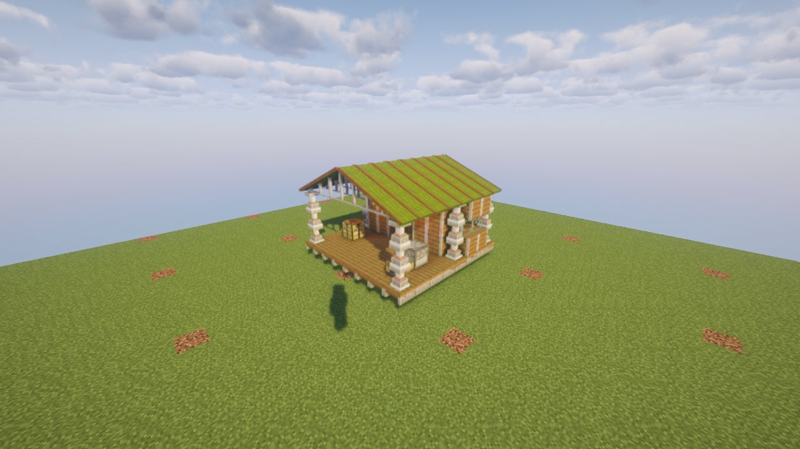

# C.A.M.P.

A portable expedition shelter for Minecraft 1.21.1 and NeoForge 21.1.248.

Place the reinforced crate and an 8x8 campsite unfolds with a deck, enclosed sleeping
and storage room, covered workshop and pitched canvas roof. The equipment is real:
a bed, double chest, crafting table, furnace and campfire. Replace equipment through
modules; the first field-kitchen upgrade adds a smoker.

**Local prototype — not released or installed on the shared server.** Crafting costs
and the visual design are still being discussed.



## Using your camp

1. Find clear, loaded 8x8 space with six blocks of headroom. The camp extends forward
   from the crate in the direction you face. Four corner supports can bridge ground
   gaps of up to three blocks. Solid obstructions, liquids and existing block entities
   refuse placement without consuming the item.
2. Place the crate and keep the site clear during its eight-second transformation.
   You may have one deployed camp across all dimensions, including unloaded camps.
3. Use the equipment normally. Light the campfire when needed. Attached parts cannot
   be harvested or replaced separately; the reserved interior does not accept extra
   player-built blocks.
4. Step outside and right-click the core's **red collapse switch**. Mining the core
   requests the same action. Only its owner or an operator can collapse it; people
   and creatures inside prevent retraction. Pick up the packed camp after it folds.
5. Sneak-use the packed item in the air to exchange sleeping, storage, crafting and
   cooking modules. Each module keeps its own inventory when removed or replaced.

Packing preserves both halves of the chest, equipment inventories and cooking state.
Cooking pauses during transport. The site’s displaced vegetation is restored.
Sleep again after relocating the camp to update your respawn location. The attached
bed refuses use in dimensions where sleeping would explode it.

Deployment requires no fuel; furnaces use their usual fuel. Other players can use
the deployed stations, while the collapse control belongs to the owner/operator.

## Prototype recipes

The current complete-camp recipe is:

```text
Iron block       Piston       Iron block
Chest            Green bed    Chest
Crafting table   Furnace      Leather
```

Individual modules currently use four iron ingots around their station, with leather
below: green bed, chest, crafting table, furnace, or smoker respectively. These recipes
are provisional; the proposed module-first crafting system is recorded in the
[project store](knowledge/PROJECT.md), not silently presented as already implemented.

## Development

```sh
JAVA_HOME=/usr/lib/jvm/java-21-openjdk-amd64 ./gradlew test runGameTestServer jar
```

`test` runs JDK-only domain tests. `runGameTestServer` starts a disposable real server
and resets only this repository's `run/world` fixture. Verification classes are in a
separate source set and are excluded from the mod jar.

`runPhotoBooth` runs the real-client visual and interaction checks, takes screenshots
under `run/booth/screenshots`, then exits. It copies the disposable test world and
sets master volume to zero. Check for an existing host rendering client and reuse the
existing Xephyr before launching; this workspace permits only one rendering client.
The reviewed setup uses the workspace's Iris/Sodium and Complementary Unbound assets
in `run/booth`; these external dependencies are not bundled or committed here.

`check` includes domain tests, server tests and the visual booth. `-PskipBooth` or
`-PskipGameTests` skips the named gate for focused development, not release validation.

Add-ons may register `ModuleItem` instances in one of four bays with immutable,
non-overlapping parts inside a 2x2x3 volume. Keep part coordinates stable across
updates because saved cargo is keyed by them. This initial Java extension point is
not a datapack module loader.

Copyright Rusty Shackleford and nfx. AGPL-3.0-or-later.
