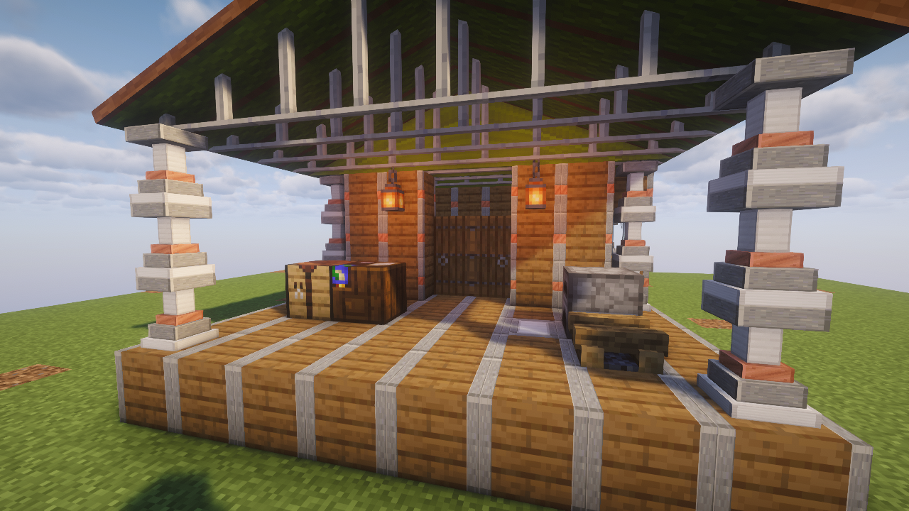
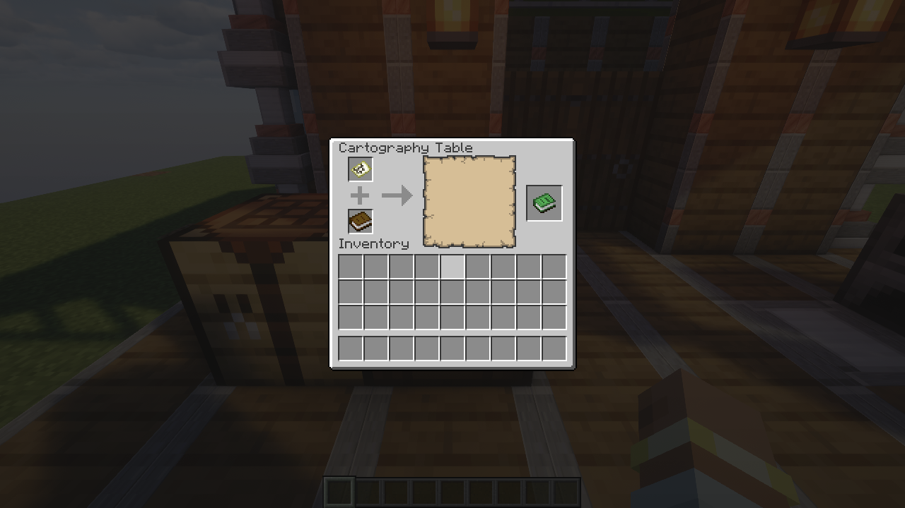

# Cartography Module — local verification

Verified September 20, 2026 (September 21 UTC). Local 0.3.0; not released.

- Java 21 `./gradlew test runGameTestServer jar --offline`: passed four JUnit
  tests and eighteen real-server GameTests. The new tests resolve the registered
  recipe, validate all four rotations, install the module through actual deployed
  menu slots, reject other bays, open both stations and clone a vanilla map.
- With the actual released Magical Map 0.1.0 jar on the test runtime, the attached
  table creates an atlas, binds another sheet and extracts that exact map. The
  upgraded camp survives real folding, item serialization and redeployment.
- `./gradlew runPhotoBooth --offline`: passed the muted self-closing shader booth
  on the native desktop, with software-rendering overrides cleared. The actual
  OpenGL renderer was NVIDIA GeForce RTX 4070/PCIe/SSE2, with Iris/Sodium and
  Complementary Unbound 5.8.1. Real client clicks opened the cartography table,
  inserted a map and book, and took the resulting atlas. Existing cargo exchange,
  collapse and packed-module-screen checks also passed.
- The workshop and menu screenshots below were inspected: both adjacent tables
  fit the covered workshop and the vanilla cartography screen shows the atlas.
  No custom model changes were required.

The public server, Prism pack and retained Magical Map practice world were not
updated. These are local development checks, not a deployment receipt.
